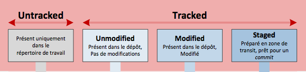
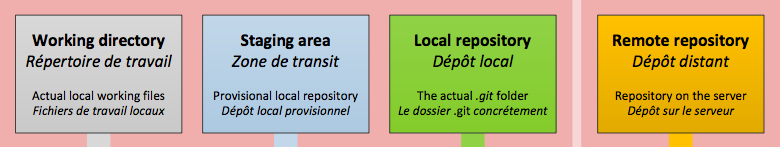
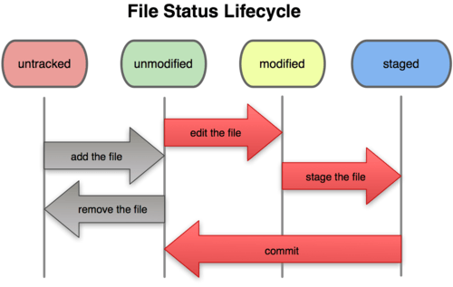
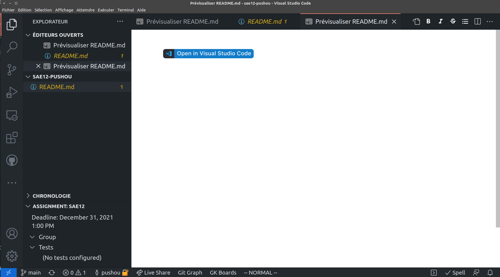
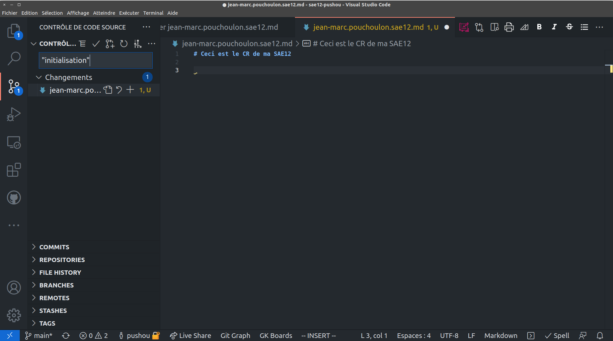
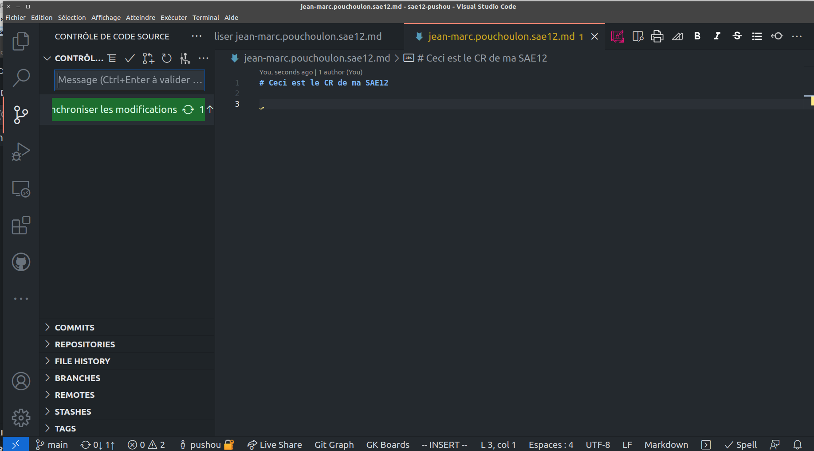
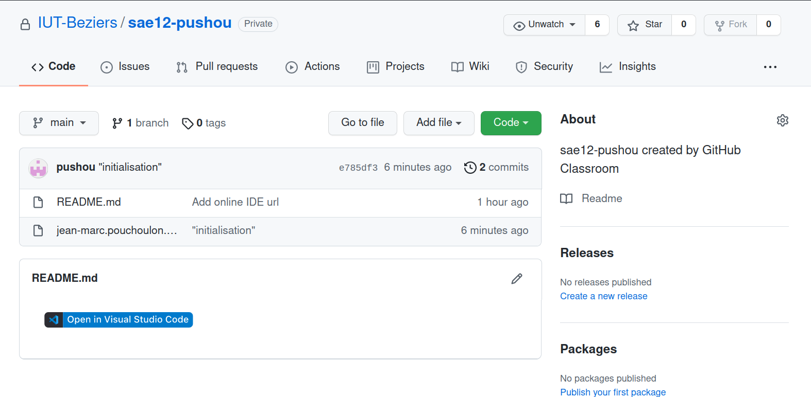

<!-- backgroundImage: url(background-cable.jpg)-->
# Git pour la SAE12

---

# Git
<!-- backgroundImage: url()-->

Dans une entreprise il faut partager l'information.
Pour les développeurs on partage du code.
Pour les administrateurs systèmes et réseaux on va partager des scripts des configurations.

---

# Fonctionnement de Git

Git réalise des instantanées de l'état d'un système de fichiers texte chaque fois qu'on effectue un **commit**. Les fichiers peuvent donc être votre compte-rendu de SAE au format Markdown.
 Source git book http://git-scm.com/book/fr CC 

---

# Indexation des fichiers par Git 

Pour dire à Git que tel fichier doit être suivi (indexé) on fait git add nom_du_fichier

 Source git book http://git-scm.com/book/fr CC 

---

# Les différentes aires de Git

 Source git book http://git-scm.com/book/fr CC 

---
# Cycle de vie d'un fichier avec Git

 Source git book http://git-scm.com/book/fr CC 

---

# En action

1. Créez un compte sur GitHub (prénom.nom) et connectez-vous.
2. Allez sur  https://classroom.github.com/a/WsrJSKax pour initialisez votre repo

---

# Création de votre compte rendu

 Créer  un fichier prenom.nom.sae12.md

---

# Commit

Sauvegarder et "comittez" le fichier dans le "contrôle de code source", puis synchroniser.

---

# Résultat sur Github

---

# Facultatif

Chantez discrètement une chanson   " il est des notres il a committé comme les autres"

---

# Ajoutez , modifiez , commitez, félicitez-vous...

