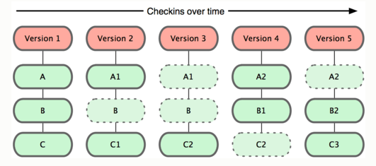
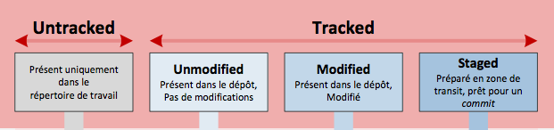
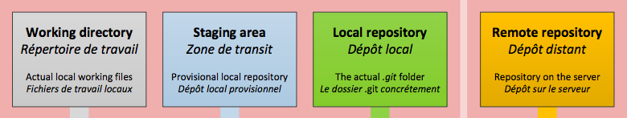
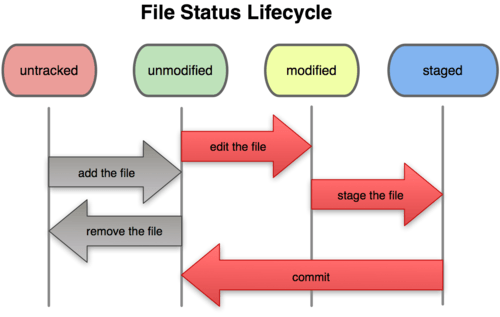
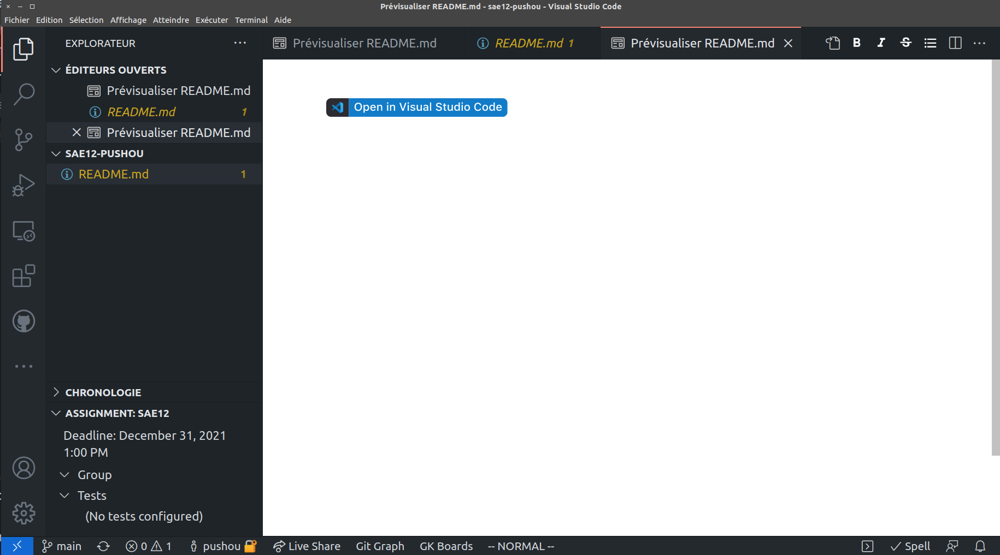
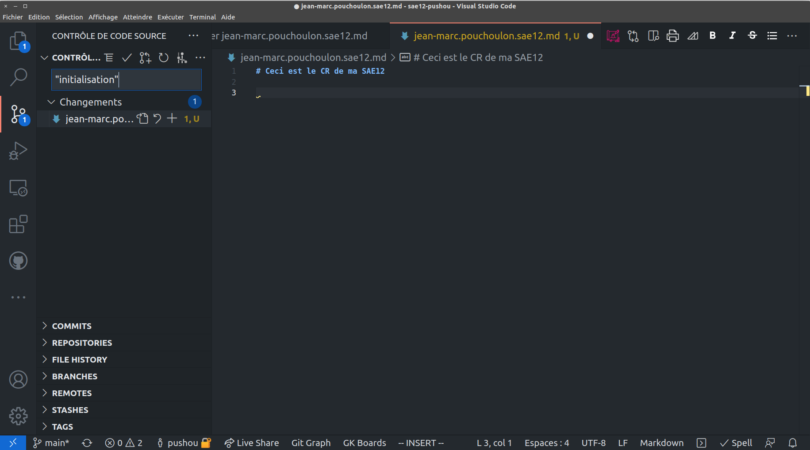
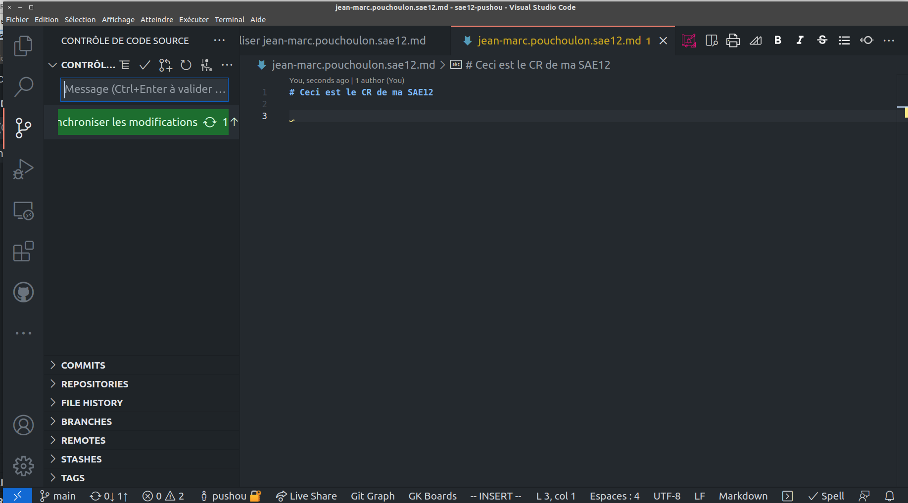
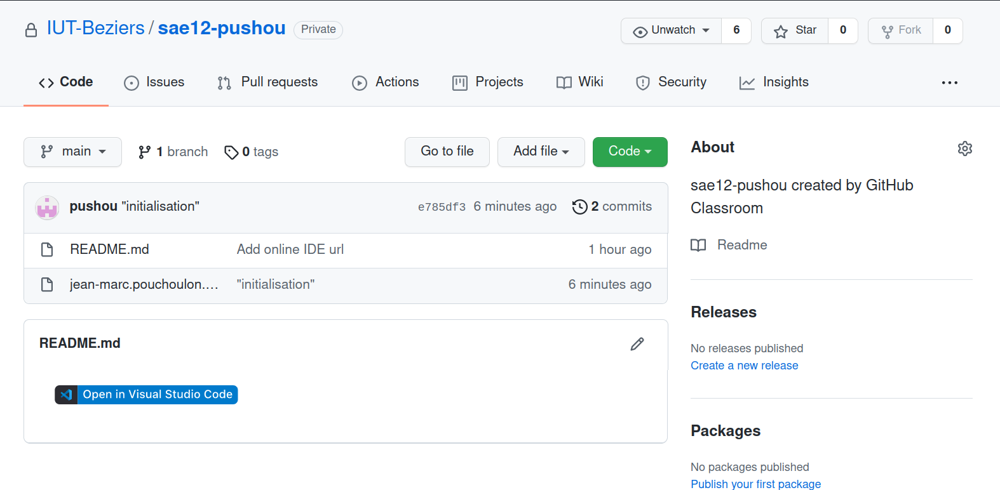

<!-- backgroundImage: url(background-cable.jpg)-->
# Git pour la SAE12

---

# Git
<!-- backgroundImage: url()-->

Dans une entreprise il faut partager l'information.
Pour les développeurs on partage du code.
Pour les administrateurs systèmes et réseaux on va partager des scripts des configurations.
Pour vous afin de créer un compte rendu.

---

# Fonctionnement de Git

Lors de chaque "commit" Git réalise des instantanés de l'état d'un système de fichiers texte. Les fichiers peuvent donc être votre compte-rendu de SAE au format Markdown.
 Source git book <http://git-scm.com/book/fr> CC 

---

# Indexation des fichiers par Git 

Pour dire à Git que tel fichier doit être suivi (indexé) on fait git add nom_du_fichier_ajouté

 Source git book <http://git-scm.com/book/fr> CC 

---

# Les différentes aires de Git

 Source git book <http://git-scm.com/book/fr> CC 

---
# Cycle de vie d'un fichier avec Git

 Source git book <http://git-scm.com/book/fr> CC 

---

# En action

1. Créez un compte sur GitHub (prénom.nom) et connectez-vous.
2. Allez sur  <https://classroom.github.com/a/WsrJSKax> pour initialisez votre repo

---

# Création de votre compte rendu

 Créer  un fichier prenom.nom.sae12.md

---

# Commit

Sauvegarder et "committez" le fichier dans le "contrôle de code source", puis synchroniser.

---

# Résultat sur Github

---

# Facultatif

Chantez discrètement une chanson   " il est des nôtres il a committé sa SAE12 comme les autres"
feel good...

---

# Ajoutez , modifiez , commitez, félicitez-vous

