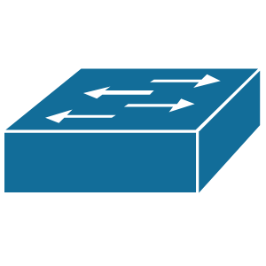
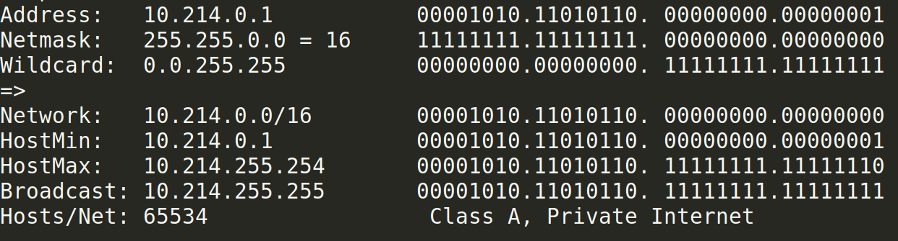
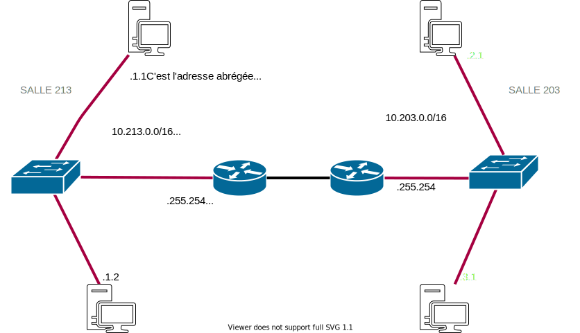

<!-- backgroundImage: url(background-cable.jpg)-->
# Ce que vous devez savoir pour la SAE12

---

# L.A.N. (Local Area Network)
<!-- backgroundImage: url()-->

**Le LAN c'est un réseau local qui contient des matériels reliés au  réseaux connectés entre eux (PC, serveurs, imprimantes, bornes wifi, smartphone...).**

---

# SWITCH

Un **switch** permet l'échange de paquets ETHERNET entre deux stations situées sur le même LAN (Local Area Network). A l'IUT un LAN = une SALLE mais ils peuvent être plus étendus ou découplés du cable physique (Virtual LAN).



---

# ROUTEUR

Un **routeur** permet l'envoi et la réception de paquets IP entre les réseaux. On dit qu'un switches sépare les domaines de collisions et un routeur les domaines de broadcast.


---

# DNS

Un serveur **DNS** permet de traduire une adresse IP en nom de domaine (F.Q.D.N.)  et réciproquement. L'adresse  IP du DNS interne de l'IUT est 10.255.255.200


---

# DHCP

Un serveur **DHCP** est chargé de distribuer des adresses IP aux matériels (stations de travail, imprimantes...) présents sur le réseaux.
Sa présence sur un réseau est utile afin de faciliter la gestion des adresses IP.


---

# Adressage IP

Chaque machine sur le réseau dispose d'une adresse IP. Elle est indispensable pour communiquer entre les stations réseaux.
Un adresse IPv4 est un identifiant de 32 bits représenté par 4 octets.
La notation est dite décimale pointée.
A l'IUT chaque salle dispose d'un réseau supportant $2^{16}$ adresses privées.

---

# Routage

Quand une station de travail envoie un datagramme IP vers une adresse, elle  applique un ET logique avec le masque de son réseau afin d'obtenir le réseau du destinataire. Par le même mécanisme elle est à même de  connaître aussi son réseau. 
Si les deux réseaux calculés sont différents le paquet IP est routé par la station vers sa passerelle par défaut.

---

# Exemple d'une adresse réseau de l'I.U.T.



---

# Schéma Réseaux type de l'I.U.T.



---

# Lister les "devices" réseaux sous Linux
Vous aurez besoin de connaître le nom de la carte réseau pour y ajouter une adresse IP. 
```bash
apt -y install lshw
sudo lshw -class network -short
Chemin matériel                   Périphérique   Classe         Description
==============================================================================
/0/100/1c/0                        wlp2s0           network        Wireless 8265 / 8275
/0/100/1c.4/0/1/0/1/0              enp12s0          network        NetXtreme BCM57761 Gigabit Ethernet 
/0/100/1f.6                        enp0s31f6        network        Ethernet Connection (5) I219-LM
/3                                 virbr0-nic       network        Ethernet interface
/4                                 lan-wrt-nic      network        Ethernet interface
/5                                 internetwrt-nic  network        Ethernet interface
```

Les cartes physiques ethernet commencent par 'en' ou 'eth' pour les machines virtuelles et les cartes wifi par 'w'.

---

# Configuration minimale IP avec routage

Configurer une IP et une route par defaut sous Linux
(le device )
```bash
ip address add 10.213.4.1/16 dev enp12s0
ip route add default via 10.213.255.254 dev enp12s0
```
Cette configuration ne résistera pas à un redémarrage du serveur.
La configuration de la couche réseau de façon persistante se fait au travers du logiciel "netplan" qui permet de définir en langage Yaml la configuration de l'adressage sur une machine. 

---

#  Exemple de configuration à l'I.U.T.

Le fichier de configuration se trouve sous /etc/netplan/01-netcfg.yaml. 

```yaml
network:
  version: 2
  renderer: networkd 
  ethernets:
    enp12s0:
      dhcp4: true
      dhcp6: false
```

---

# Exemple avec de l'adressage statique, la passerelle par défaut et le DNS de l'IUT.

```yaml
network:
    version: 2
    ethernets:
        eth0:
            addresses: [10.214.1.1/16]
            gateway4: 10.214.255.254
            nameservers:
                addresses: [10.255.255.200]
            dhcp4: false
            dhcp6: false
```

---

# Commandes Netplan

Après modification du fichier yaml (attention l'indentation est essentielle)  vous saisirez les commandes suivantes:

```bash
sudo netplan generate 
sudo netplan apply
```

---

# Vous vérifierez votre réussite avec les commandes suivantes:

```bash
netplan ip leases eth0 # si dhcp
ip address show device eth0
networkctl 
resolvectl  
resolvectl  query www.iutbeziers.fr
ip route show default
```

---