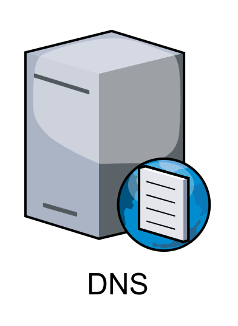

<!-- backgroundImage: url(background-cable.jpg)-->
# Ce que vous devez savoir pour la SAE12

---
# L.A.N. (Local Area Network)
<!-- backgroundImage: url()-->

**Le LAN c'est un réseau local qui contient des items réseaux connectés entre eux (PC, serveurs, imprimantes, bornes wifi, smartphone...).**

---

# SWITCH
Un **switch** permet l'échange de paquets ETHERNET entre deux stations situées sur le même LAN (Local Area Network). A l'IUT un LAN = une SALLE mais ils peuvent être plus étendus ou découplés du cable physique (Virtual LAN).

---

# ROUTEUR

Un **routeur** permet l'envoi et la réception de paquets IP entre les réseaux.

---
# DNS

Un serveur **DNS** permet de traduire une adresse IP en nom de domaine (F.Q.D.N.)  et réciproquement. L'adresse  IP du DNS interne de l'IUT est 10.255.255.200

---

# Réseaux IUT

---

# DHCP

Un serveur **DHCP** est chargé de distribuer des adresses IP aux matériels (stations de travail, imprimantes...) présents sur le réseaux.
Sa présence est fortement conseillé (facilité de gestion, sécurité).

---
